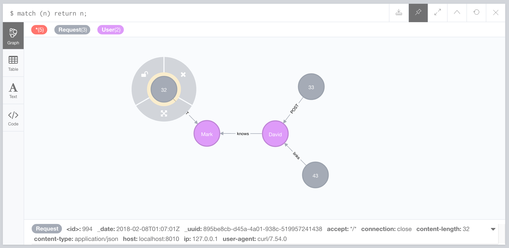

# Neo4j Cloud Functions

[](https://github.com/moxious/neo4j-serverless-functions/actions)

Cloud functions for working with Neo4j.  Deploy these to Google Cloud, and you can pipe
data into Neo4j from any system that can make an HTTP request, or can send a message to
a PubSub topic, like Cloud Dataflow, PubSub itself, and many others.

## Features

* Endpoint for running batched Cypher operations
* Endpoint for piping in data via the CUD format
* PubSub and HTTP availability

## Pre-Requisites

- Have a Google Cloud project
- Have `gcloud` CLI installed
- Enable the Cloud Functions API on that project.
- Enable the Secrets Manager API
- Create a service account with access to APIs above

## Setup

```
yarn install
```

## Configure

On this branch you may use Google Secrets manager with the following keys, and ensure
that your service account has access to the following secrets.  Only the latest versions
will be used.

- `NEO4J_USER`
- `NEO4J_PASSWORD`
- `NEO4J_URI`

*If you do not enable secrets manager, the secrets will be taken from environment variables of the same name*

The functions will not execute correctly if these details are not provided one way or the other.

As an env var, you may set `GOOGLE_PROJECT` to point to the project where the secrets
should be taken from.

## Deploy

*Make sure to tweak the settings in this deploy*.  This deploys unsecured functions
that unauthenticated users can connect to.  Tailor the settings to your needs.

### PubSub Triggered Functions

Make sure to customize the trigger topic and environment variables!

```
# Ensure Google Secret Manager secrets are set

gcloud functions deploy cudPubsub \
     --ingress-settings=all --runtime=nodejs10 --allow-unauthenticated \
     --timeout=300 \
     --set-env-vars GOOGLE_PROJECT=graphs-are-everywhere \
     --trigger-topic neo4j-cud

gcloud functions deploy cypherPubsub \
     --ingress-settings=all --runtime=nodejs10 --allow-unauthenticated \
     --timeout=300 \
     --set-env-vars GOOGLE_PROJECT=graphs-are-everywhere \
     --trigger-topic cypher
```

### HTTP Functions

```
export NEO4J_USER=neo4j
export NEO4J_PASSWORD=secret
export NEO4J_URI=neo4j+s://my-host:7687/

gcloud functions deploy cud \
     --ingress-settings=all --runtime=nodejs10 --allow-unauthenticated \
     --timeout=300 \
     --set-env-vars NEO4J_USER=$NEO4J_USER,NEO4J_PASSWORD=$NEO4J_PASSWORD,NEO4J_URI=$NEO4J_URI \
     --trigger-http

gcloud functions deploy cypher \
     --ingress-settings=all --runtime=nodejs10 --allow-unauthenticated \
     --timeout=300 \
     --set-env-vars NEO4J_USER=$NEO4J_USER,NEO4J_PASSWORD=$NEO4J_PASSWORD,NEO4J_URI=$NEO4J_URI \
     --trigger-http

gcloud functions deploy node \
     --ingress-settings=all --runtime=nodejs10 --allow-unauthenticated \
     --timeout=300 \
     --set-env-vars NEO4J_USER=$NEO4J_USER,NEO4J_PASSWORD=$NEO4J_PASSWORD,NEO4J_URI=$NEO4J_URI \
     --trigger-http

gcloud functions deploy edge \
     --ingress-settings=all --runtime=nodejs10 --allow-unauthenticated \
     --timeout=300 \
     --set-env-vars NEO4J_USER=$NEO4J_USER,NEO4J_PASSWORD=$NEO4J_PASSWORD,NEO4J_URI=$NEO4J_URI \
     --trigger-http
```

[See related documentation](https://cloud.google.com/functions/docs/env-var)

## Quick Example of functions and their results

```
# Given this local deploy URL prefix (provided by local testing above)
LOCALDEPLOY=http://localhost:8080/

# CUD
curl --data @test/cud-messages.json \
    -H "Content-Type: application/json" -X POST \
    $LOCALDEPLOY

# Cypher
curl --data @test/cypher-payload.json \
    -H "Content-Type: application/json" -X POST \
    $LOCALDEPLOY

# Node
curl -H "Content-Type: application/json" -X POST \
   -d '{"username":"xyz","name":"David"}' \
   $LOCALDEPLOY/node?label=User

# Node
curl -H "Content-Type: application/json" -X POST \
   -d '{"username":"foo","name":"Mark"}' \
   $LOCALDEPLOY/node?label=User

# Edge
curl -H "Content-Type: application/json" -X POST \
   -d '{"since":"yesterday","metadata":"whatever"}' \
   $LOCALDEPLOY'/edge?fromLabel=User&fromProp=username&fromVal=xyz&toLabel=User&toProp=username&toVal=foo&relType=knows'
```



## Node Function

This function takes JSON body data reported into the endpoint, and creates a node with a specified label having those properties.   Example:

```
curl -XPOST -d '{"name":"Bob"}' http://cloud-endpoint/node?label=Person
```

Will result in a node with the label Foo, having property names like `name:"Bob"`.

If deeply nested JSON is posted to the endpoint, the dictionary will be flattened, so that:
```
{
    "model": {
        "name": "something"
    }
}
```

Will turn into a property

```
`model.name`: "something"
```

in neo4j.

By customizing the URL you use for the webhook, you can track source of data.  For example,
providing to the slack external webhook a URL of: `http://cloud-endpoint/node?label=SlackMessage`.

## Edge Function

This function matches two nodes, and creates a relationship between them with a given set of properties.

Example:

```
curl -XPOST -d '{"x":1,"y":2}' 'http://localhost:8010/test-drive-development/us-central1/edge?fromLabel=Foo&toLabel=Foo&fromProp=x&toProp=x&fro=6&toVal=5&relType=blark'
```

This is equivalent to doing this in Cypher:

```
   MATCH (a:Foo { x: "5" }), (b:Foo { x: "6" })
   CREATE (a)-[:blark { x: 1, y: 2 }]->(b);
```

Any POST'd JSON data will be stored as properties on the relationship.

## CUD Function

The CUD function takes an array of CUD command objects.

The CUD format is a tiny JSON format that allows you to specify a graph "Create, Update,
or Delete" (CUD) operation on a graph.  For example, a JSON message may indicate that you
want to create a node with certain labels and properties.

[See here for documentation on the CUD format](https://neo4j.com/docs/labs/neo4j-streams/current/consumer/#_cud_file_format)

Example:

```
curl --data @test/cud-messages.json \
    -H "Content-Type: application/json" -X POST \
    $LOCALDEPLOY
```

## Cypher Function

It takes two simple arguments:  a cypher string, and an array of batch inputs.  An example
input would look like this:

```
{
    "cypher": "CREATE (p:Person) SET p += event",
    "batch": [
        { "name": "Sarah", "age": 22 },
        { "name": "Bob", "age": 25 }
    ]
}
```

Your query will always be prepended with the clause `UNWIND batch AS event` so that
the "event" variable reference will always be defined in your query to reference an individual
row of data.

Here's another example which would create a set of relationships

```
{
    "cypher": "MERGE (p1:Person{name: event.originator}) MERGE (p2:Person{name: event.accepter}) MERGE (p1)-[:FRIENDED { date: event.date }]->(p2)",
    "batch": [
       { "originator": "John", "accepter": "Sarah", "date": "2020-01-01" },
       { "originator": "Anita", "accepter": "Joe", "date": "2020-01-02" },
       { "originator": "Baz", "accepter": "John", "date": "2020-01-03" },
       { "originator": "Evander", "accepter": "Sarah", "date": "2020-01-04" },
       { "originator": "Idris", "accepter": "Evander", "date": "2020-01-05" },
       { "originator": "Sarah", "accepter": "Baz", "date": "2020-01-06" },
       { "originator": "Nia", "accepter": "Joe", "date": "2020-01-01" },
       { "originator": "Joe", "accepter": "Baz", "date": "2020-01-03" },
       { "originator": "Bob", "accepter": "Idris", "date": "2020-01-03" },
       { "originator": "Joe", "accepter": "Evander", "date": "2020-01-03" }
    ]
}
```

## Security

*It is very important you secure access to the functions in a way that is appropriate
to your database*.  These functions fundamentally allow users to run cypher and modify
data, so take care to use the existing Google Cloud Functions utilities to secure
the endpoints.

The development documentation in this repo assume an insecure "anyone can call this"
endpoint.  I recommend using [Google Cloud identity or network-based access control](https://cloud.google.com/functions/docs/securing)

## Unit Testing

```
yarn test
```

## Local Testing

```
./node_modules/.bin/functions-framework --target=cud
./node_modules/.bin/functions-framework --target=cypher
./node_modules/.bin/functions-framework --target=node
./node_modules/.bin/functions-framework --target=edge
```
